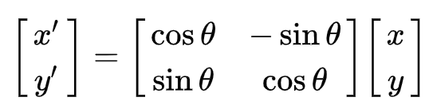
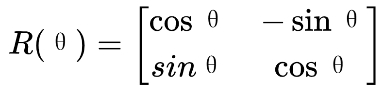
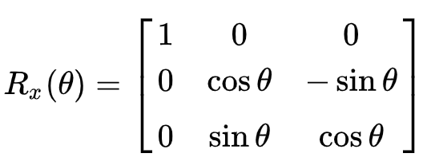
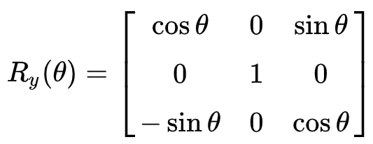
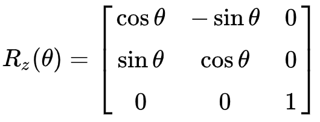
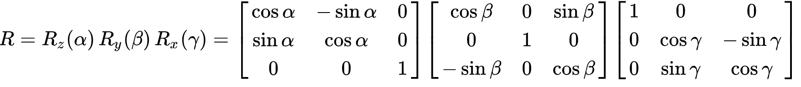
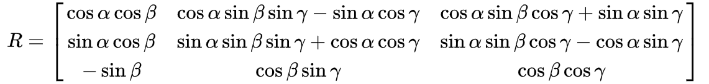

## 1. Two-Dimensional Space

In a two-dimensional coordinate system, the vector OP rotates by β to obtain P'.

x'=OP*cos(α+β) \
y'=OP*sin(α+β)

The length of OP is l, and the length of OP' is also l.\
The coordinates of P are (x, y) \
x=l* cos(β)\
y=l* sin(β)

The coordinates of P' are (x', y') \
x'=l* cos(α+β)=l*[cos(α)*cos(β)+sin(α)*sin(β)]=l*cos(β)*cos(α)+l*sin(β)*sin(α)=x*cos(α)+y*sin(α)
\
y=l* sin(α+β)=l*[sin(α)*cos(β)+cos(α)*sin(β)]=l*cos(β)*sin(α)+l*sin(β)*cos(α)=x*sin(α)+y*cos(α)

Thus, the coordinates of P' can be expressed as
P'=(x*cos(α)+y*sin(α),x*sin(α)+y*cos(α))
The coordinates of P' represented using a matrix are \
 \
From this, it can be concluded that a point P(x, y) in a two-dimensional Cartesian coordinate system, when rotated counterclockwise by an angle θ around the origin, results in point P' (x', y'), which can be represented as point A multiplied by the rotation matrix R(θ) to obtain point B.
The rotation matrix R(θ) is \

## 2. Three-Dimensional Space
A point A(x, y, z) in a three-dimensional Cartesian coordinate system, after rotating by an angle θ around the X-axis according to the right-hand rule, then by an angle θ around the Y-axis according to the right-hand rule, and finally by an angle θ around the Z-axis according to the right-hand rule, results in point B(x', y', z'). These three rotations can be represented as point A undergoing three matrix transformations to obtain point B, with rotation matrices Rx(θ), Ry(θ), and Rz(θ) respectively.

Assuming a point B, with a rotation angle γ around the X-axis, a rotation angle β around the Y-axis, and a rotation angle α around the Z-axis.
Let R be the equivalent rotation matrix of the three rotations Rz(α), Ry(β), and Rx(γ), then R = Rz(α)·Ry(β)·Rx(γ)
The coordinates of point B are obtained by multiplying the coordinates of point A by the rotation matrix, i.e., B = R·A

If Euler angles are used, γ corresponds to Roll; β corresponds to Pitch; α corresponds to Yaw.
