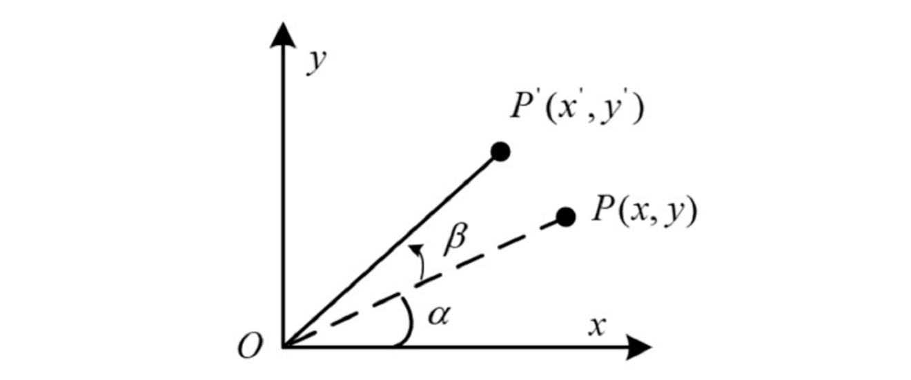
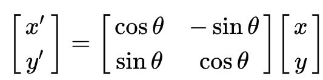
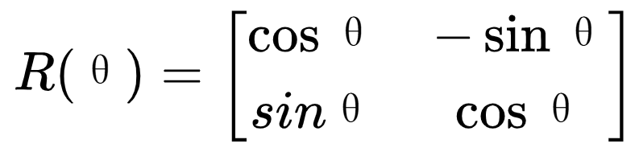
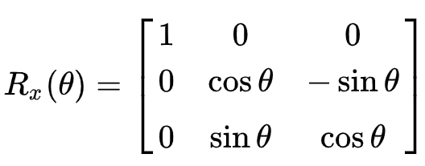
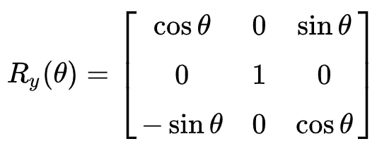
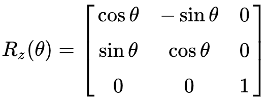

## 1. 二维空间

二维坐标系中，向量OP旋转β得到P' \

x'=OP*cos(α+β)=OP \
y'=OP*sin(α+β)

OP的长度为l，OP'的长度也为l
P的坐标为(x,y), 其中\
x=l* cos(β)\
y=l* sin(β)

P'的坐标为(x',y') \
x'=l* cos(α+β)=l*[cos(α)*cos(β)+sin(α)*sin(β)]=l*cos(β)*cos(α)+l*sin(β)*sin(α)=x*cos(α)+y*sin(α)
\
y=l* sin(α+β)=l*[sin(α)*cos(β)+cos(α)*sin(β)]=l*cos(β)*sin(α)+l*sin(β)*cos(α)=x*sin(α)+y*cos(α)

所以P'的坐标可以表示为\
P'=(x*cos(α)+y*sin(α),x*sin(α)+y*cos(α))

P'的坐标使用矩阵表示为 \
 \
以上可以得出，二维直角坐标系内的点P(x,y)绕原点逆时针旋转角度θ，得到点P' (x',y')，可以表示为点A左乘旋转矩阵R(θ)得到点B.
其中旋转矩阵R(θ) \

## 三维空间
三维直角坐标系内的点A(x,y,z)，先绕X按右手定则旋转角度θ，再绕Y轴按右手定则旋转角度θ，再绕Z轴按右手定则旋转角度θ，得到点B(x',y',z')，这三次旋转可以表示为点A经过三次矩阵变换得到点B,旋转矩阵分别为Rx(θ), Ry(θ), Rz(θ) \

 \
 \
 \

